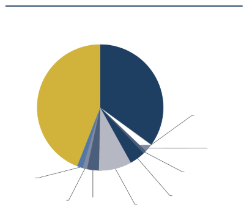

![ref1]

**Created with an evaluation copy of Aspose.Words. To remove all limitations, you can use Free Temporary License [https://products.aspose.com/words/temporary-license/**](https://products.aspose.com/words/temporary-license/)**

**Government of India**

Ministry of Health and Family Welfare

**Bihar**

**National Family Health Survey (NFHS-5) 2019-21**

**India**

International Institute for Population Sciences Deonar, Mumbai 400 088

**NATIONAL FAMILY HEALTH SURVEY (NFHS-5) INDIA** 

**2019-21** 

**BIHAR**  

MAY 2021 

Suggested citation: International Institute for Population Sciences (IIPS) and ICF. 2021. *National Family Health Survey (NFHS-5), India, 2019-21: Bihar.* Mumbai: IIPS. 

For additional information about the 2019-21 National Family Health Survey (NFHS-5), please contact: 

International Institute for Population Sciences, Govandi Station Road, Deonar, Mumbai-400088 Telephone: 022-4237 2442 

Email: nfhs52017@gmail.com, director@iipsindia.ac.in 

For related information, visit http://www.rchiips.org/nfhs or http://www.iipsindia.ac.in 

**CONTRIBUTORS** 

**S.K. Singh 
Laxmi Kant Dwivedi Chander Shekhar      Brajesh**  

**Evaluation Only. Created with Aspose.Words. Copyright 2003-2025 Aspose Pty Ltd.**
![ref2]

**CONTENTS **

Page 

**KEY FINDINGS**

Introduction .............................................................................................................................................. 1 Household Characteristics ...................................................................................................................... 3 Education ................................................................................................................................................... 6 Fertility  ...................................................................................................................................................... 7 Family Planning ..................................................................................................................................... 10 Infant and Child Mortality .................................................................................................................... 12  Maternal Health...................................................................................................................................... 14  Child Health ............................................................................................................................................ 18 Breastfeeding, Nutrition, and Anaemia .............................................................................................. 21 Adult Health and Health Care ............................................................................................................. 25 HIV/AIDS ............................................................................................................................................... 27 Sexual Behaviour .................................................................................................................................... 29 Women’s Empowerment ...................................................................................................................... 29 Domestic Violence .................................................................................................................................. 32 

**TABLES** 

Table 1      Results of the household and individual interviews ..................................................... 35 Table 2      Results of the household and individual interviews by district................................... 36 Table 3      Household population by age, schooling, residence, sex,  

`                    `and possession of an *Aadhaar* card................................................................................... 37 Table 4      Household and housing characteristics ........................................................................... 38 Table 5      Access to a toilet facility ..................................................................................................... 42 Table 6      Access to a toilet facility by district .................................................................................. 43 Table 7      Household possessions and land ownership .................................................................. 44 Table 8      Preschool attendance .......................................................................................................... 45 Table 9      Preschool attendance by district........................................................................................ 46 Table 10    School attendance ................................................................................................................ 47 Table 11    Children's living arrangements and orphanhood .......................................................... 48 Table 12    Birth registration of children under age 5 ........................................................................ 49 Table 13    Birth registration of children under age 5 by district ..................................................... 50 Table 14    Death registration ................................................................................................................ 51 Table 15    Death registration by district ............................................................................................. 52 Table 16    Disability ............................................................................................................................... 53 Table 17    Background characteristics of respondents ..................................................................... 54 Table 18    Fertility trends ...................................................................................................................... 56 Table 19    Fertility by background characteristics ............................................................................ 57 Table 20    Teenage pregnancy and motherhood ............................................................................... 58 Table 21    Birth order  ........................................................................................................................... 59 Table 22    Birth intervals  ...................................................................................................................... 60 

**Evaluation Only. Created with Aspose.Words. Copyright 2003-2025 Aspose Pty Ltd.**
![ref3]Page 

Table 23    Fertility preferences by number of living children  ........................................................ 61 Table 24    Desire not to have any more children .............................................................................. 62 Table 25    Ideal number of children  ................................................................................................... 63 Table 26    Indicators of sex preference ............................................................................................... 64 Table 27    Knowledge of contraceptive methods .............................................................................. 65 Table 28    Current use of contraception by background characteristics ....................................... 68 Table 29    Current use of contraceptive methods by district .......................................................... 70 Table 30    Contraceptive use by men at last sexual intercourse ..................................................... 71 Table 31    Source of modern contraceptive methods ....................................................................... 73 Table 32    Informed choice ................................................................................................................... 76 Table 33    Twelve-month contraceptive discontinuation rates ....................................................... 77 Table 34    Men's contraception-related perceptions and knowledge ............................................ 78 Table 35    Need and demand for family planning among currently                      married women ................................................................................................................. 79 Table 36    Unmet need for family planning by district .................................................................... 80 Table 37    Hysterectomy ....................................................................................................................... 81 Table 38    Pregnancy outcome ............................................................................................................. 82 Table 39    Characteristics of abortions ................................................................................................ 83 Table 40    Age at first marriage ........................................................................................................... 85 Table 41    Early childhood mortality rates......................................................................................... 86 Table 42    Early childhood mortality rates by background characteristics ................................... 87 Table 43    High-risk fertility behaviour .............................................................................................. 88 Table 44    Antenatal care ...................................................................................................................... 89 Table 45    Antenatal care services and information received ......................................................... 90 Table 46    Antenatal care indicators .................................................................................................... 91 Table 47    Antenatal care indicators by district ................................................................................. 92 Table 48    Advice received during pregnancy .................................................................................. 93 Table 49    Pregnancies for which an ultrasound test was done ...................................................... 94 Table 50    Pregnancy registration and Mother and Child Protection Card .................................. 96 Table 51    Delivery and postnatal care ............................................................................................... 97 Table 52    Delivery and postnatal care by background characteristics ......................................... 99 Table 53    Delivery and postnatal care by district .......................................................................... 101 Table 54    Delivery costs and financial assistance .......................................................................... 102 Table 55    Birth order and delivery characteristics by district ...................................................... 103 Table 56    Timing of first health check after birth for the newborn ............................................. 104 Table 57    Trends in maternal care indicators ................................................................................. 105 Table 58    Male involvement in maternal care: Men's report ........................................................ 106 Table 59    Vaccinations by background characteristics.................................................................. 107 Table 60    Vaccinations by district..................................................................................................... 109 Table 61    Prevalence and treatment of symptoms of ARI and fever .......................................... 111 Table 62    Prevalence and treatment of diarrhoea .......................................................................... 112 Table 63    Feeding practices during diarrhoea ................................................................................ 114 Table 64    Knowledge of ORS packets .............................................................................................. 115 Table 65    Indicators of utilization of ICDS services....................................................................... 116 

Table 66    Utilization of ICDS services during pregnancy and  

`                      `while breastfeeding ........................................................................................................ 118 Table 67    Nutritional status of children .......................................................................................... 119 Table 68    Initial breastfeeding .......................................................................................................... 122 Table 69    Breastfeeding status by age .............................................................................................. 123 Table 70    Median duration of breastfeeding and infant and  

`                     `young child feeding (IYCF) practices ........................................................................... 124 Table 71    Minimum acceptable diet ................................................................................................. 125 Table 72    Child feeding practices and nutritional status of children by district ....................... 127 Table 73    Prevalence of anaemia in children .................................................................................. 128 Table 74    Micronutrient intake among children ............................................................................ 130 Table 75    Presence of iodized salt in household ............................................................................ 132 Table 76    Presence of iodized salt in household by district ......................................................... 133 Table 77    Women's and men's food consumption ......................................................................... 134 Table 78    Nutritional status of adults .............................................................................................. 135 Table 79    Waist circumference and waist-to-hip ratio .................................................................. 137 Table 80    Prevalence of anaemia in adults ...................................................................................... 139 Table 81    Nutritional status and anaemia among children and women 

`                     `by district .......................................................................................................................... 141 Table 82    Knowledge and prevention of HIV/AIDS .................................................................... 142 Table 83.1 Accepting attitudes toward those living with HIV/AIDS: Women .......................... 144 Table 83.2 Accepting attitudes toward those living with HIV/AIDS: Men ................................ 146 Table 84    Sexual behaviour, HIV testing, blood transfusion, and injections ............................. 148 Table 85    Knowledge of HIV/AIDS and sexual behaviour among youth................................. 149 Table 86    Prevalence of tuberculosis ................................................................................................ 150 Table 87    Knowledge and attitudes toward tuberculosis ............................................................. 151 Table 88    Health insurance coverage among women and men ................................................... 153 Table 89    Source of health care and health insurance coverage among 

`                      `households ...................................................................................................................... 154 Table 90    Health problems ................................................................................................................ 155 Table 91    Screening tests for cancer ................................................................................................. 157 Table 92.1 Blood pressure status: Women ........................................................................................ 158 Table 92.2 Blood pressure status: Men .............................................................................................. 160 Table 93.1 Random blood glucose levels: Women .......................................................................... 162 Table 93.2 Random blood glucose levels: Men ................................................................................ 163 Table 94   Tobacco and alcohol use by women and men ............................................................... 164 Table 95   Methods of menstrual protection ..................................................................................... 165 Table 96   Employment and cash earnings of women and men .................................................... 166 Table 97   Control over and magnitude of women's and men's cash earnings ........................... 167 Table 98   Participation in decision making...................................................................................... 168 Table 99   Decision making by background characteristics ........................................................... 169 Table 100 Women's access to money and credit .............................................................................. 171 Table 101 Ownership of assets ........................................................................................................... 173 Table 102 Gender role attitudes ......................................................................................................... 174 Table 103 Gender role attitudes by background characteristics ................................................... 175 Table 104 Experience of physical and sexual violence ................................................................... 177 Table 105 Experience of violence during pregnancy ...................................................................... 178 Table 106 Forms of spousal violence ................................................................................................. 179 Table 107 Spousal violence by background characteristics ........................................................... 180 Table 108 Spousal violence by husband's characteristics and 

`                    `empowerment indicators ................................................................................................ 182 Table 109 Injuries to women due to spousal violence .................................................................... 184 Table 110 Help seeking ........................................................................................................................ 185 

**APPENDIX** 

Estimates of sampling errors .............................................................................................................. 187 

**Evaluation Only. Created with Aspose.Words. Copyright 2003-2025 Aspose Pty Ltd.**
![ref4]

**INTRODUCTION**  

The 2019-21 National Family Health Survey (NFHS-5), the fifth in the NFHS series, provides information on population, health, and nutrition for India and each state and union territory. Like NFHS-4, NFHS-5 also provides district-level estimates for many important indicators. All five NFHS surveys have been conducted under the stewardship of the Ministry of Health and Family  Welfare  (MoHFW),  Government  of  India.  MoHFW  designated  the  International Institute for Population Sciences (IIPS), Mumbai, as the nodal agency for the surveys. Funding for NFHS-5 was provided by the Government of India. Technical assistance and additional funding for NFHS-5 was provided by the USAID-supported Demographic and Health Surveys Program, ICF, USA. Assistance for some of the Clinical, Anthropometric, and Biochemical (CAB) tests was provided by the ICMR and the National AIDS Research Institute (NARI), Pune. 

Four  survey  questionnaires—household,  woman’s,  man’s,  and  biomarker—were  used  to collect information in 19 languages using Computer Assisted Personal Interviewing (CAPI). All women age 15-49 and men age 15-54 in the selected sample households were eligible for interviewing. In the household questionnaire, basic information was collected on all usual members of the household and visitors who stayed in the household the previous night, as well as socioeconomic characteristics of the household, water and sanitation, health insurance, and number of deaths in the household in the three years preceding the survey. Two versions of the woman’s  questionnaire  were  used  in  NFHS-5.  The  first  version  (district  module),  which collected  information  on  women’s  characteristics,  marriage,  fertility,  contraception, reproductive health, children’s immunizations, treatment of childhood illnesses, and nutrition was fielded in the entire sample of NFHS-5 households. Information on these topics is available at the district, state, and national levels. In the second version of the questionnaire (state module), four additional topics, namely, sexual behaviour, HIV/AIDS, husband’s background and women’s work, and domestic violence, were also included. This version was fielded in a subsample  of  NFHS-5  households  designed  to  provide  information  only  at  the  state  and national levels. The man’s questionnaire covered the man’s characteristics, marriage, number of children, contraception, fertility preferences, nutrition, sexual behaviour, attitudes towards gender roles, HIV/AIDS, and lifestyle. The biomarker questionnaire covered measurements of height,  weight,  and  haemoglobin  levels  for  children;  height,  weight,  waist  and  hip circumference,  haemoglobin  levels,  and finger-stick blood for additional  CAB testing in a laboratory for women age 15-49 and men age 15-54; and blood pressure and random blood glucose for women and men age 15 years and over. Questionnaire information and biomarkers were collected only with informed consent from the respondents. 

The NFHS-5 sample was designed to provide estimates of all key indicators at the national and state levels, as well as estimates for most key indicators at the district level (for all 707 districts in India, as on 31 March, 2017). The total sample size of approximately 610,000 households for India was based on the size needed to produce reliable indicator estimates for each district. The rural sample was selected through a two-stage sample design with villages as the Primary Sampling  Units  (PSUs)  at  the  first  stage  (selected  with  probability  proportional  to  size), followed by a random selection of 22 households in each PSU at the second stage. In urban areas,  there  was  also  a  two-stage  sample  design  with  Census  Enumeration  Blocks  (CEB) 

**Evaluation Only. Created with Aspose.Words. Copyright 2003-2025 Aspose Pty Ltd.**

1
![ref5]

selected at the first stage and a random selection of 22 households in each CEB at the second stage.  At  the  second  stage  in  both  urban  and  rural  areas,  households  were  selected  after conducting a complete mapping and household listing operation in the selected first-stage units.  

Readers should be cautious while interpreting and comparing the trends as some States/UTs may have a smaller sample size. Moreover, at the time of survey, *Ayushman* *Bharat* AB-PMJAY and *Pradhan Mantri Surakshit Matritva Abhiyan* (PMSMA) were not fully rolled out and hence, their coverage may not have been factored in the results of the percentage of households with any usual member covered under a health insurance/financing scheme and the percentage of mothers who received 4 or more antenatal care visits, respectively. Hence, the results should be interpreted with caution. 

NFHS-5 fieldwork for Bihar was conducted in all 38 districts of the state from 9 July, 2019 to 2 February,  2020  by  Development  and  Research  Services  Pvt.  Ltd.  (DRS).  Information  was collected from 35,834 households, 42,483 women age 15-49 (including 6,350 women interviewed in PSUs in the state module), and 4,897 men age 15-54.  

This report presents the key findings of the NFHS-5 survey in Bihar, followed by detailed tables and an appendix on sampling errors. At the time of finalization of this report, wealth quintiles for the country as a whole were not ready. Therefore, on finalization of the national report, the breakup of key indicators by wealth quintiles for all states will be provided as an additional document and uploaded on the official website of MoHFW and IIPS. 

**HOUSEHOLD CHARACTERISTICS**  

Important household characteristics includes household composition, housing characteristics, household possessions, access to a toilet facility, and education. The household characteristics reflect the environmental risk factors and behavioural outcomes of the household population, including their likely impact on health status.  

**Household composition**  

In Bihar, over four-fifths (84%) of the households are in rural areas. On average, households are comprised of 4.8 members. Twenty-three percent of households are headed by women, with 19 percent of the population living in female-headed households.  

Eighty-six percent of households in Bihar have household heads who are Hindu. Fourteen percent of households have household heads who are Muslim.  

More than half of households (53%) in Bihar have household heads who belong to an other backward class and nearly one-quarter (24%) belong to a scheduled caste. Four percent of household heads belong to a scheduled tribe. About one-fifth (18%) of Bihar’s household heads do not belong to a scheduled caste, a scheduled tribe, or an other backward class. More than half of  households  (57%)  are  nuclear,  and  43  percent  of  the  population  reside  in  non-nuclear households.  

More than one-third (36%) of Bihar’s population is under age 15; only 7 percent is age 65 and over. The overall sex ratio of the population is 1,090 females per 1,000 males, and the sex ratio of the population under 7 years of age is lower (916 females per 1,000 males). Eighty-six percent of persons have an *Aadhaar* card.  

Among children below 18 years of age, 4 percent have experienced the death of one or both parents. In all, 68 percent of children below 18 years of age live with both parents, 28 percent live with one parent (mostly with their mother), and the remaining 4 percent live with neither parent. Over three-quarters (76%) of births of children under 5 years of age were registered with the civil authorities, and 56 percent of children have a birth certificate.  

**Death registration** 

Thirty-seven percent of deaths of usual households members in the three years preceding the survey were registered with the civil authorities, 28 percent of deaths at age 0-4, 45 percent of deaths at age 25-34, and 41 percent of deaths at age 35 and above.  

The  distribution  of  death  registrations  by  religion  shows  that  38  percent  of  deaths  were registered among Hindus and 32 percent among Muslims. Only about one-third of deaths were registered among scheduled castes (31%) and scheduled tribes (33%), and almost two-fifths among other backward classes (38%) and among those who do not belong to a scheduled caste, a scheduled tribe, or an other backward class (43%). Overall in Bihar, death registration is higher in urban (48%) than rural areas (36%) and among males (43%) than females (31%).  

**Disability**  

The respondent to the Household Questionnaire provided information for all usual household members on whether or not they have any disability in specified domains. The domains of disability are hearing, speech, visual, mental, locomotor, and other. Nearly 1 percent (0.9%) of the *de jure* household population has any disability. The most common types of disabilities are locomotor (0.4%), speech disability and mental disability (0.2% each), and hearing and visual (0.1% each). Women are slightly less likely than men to have any disability (0.7% women compared with 1.1% men). The proportion of household members who have any disability rises with increasing age. For instance, 2 percent of the household members age 70 and above are reported to have any disability, compared with 1 percent or less of household members in the younger age groups. 

**Housing characteristics**  

Only one-third (34%) of households in Bihar live in a *pucca* house, 54 percent live in a semi-*pucca* house, but almost all households (96%) have electricity. Ninety-eight percent of households in Bihar have basic drinking water service, and 99 percent of households use an improved source of drinking water, but only 9 percent have water piped into their dwelling, yard, or plot. A large majority (83%) have a tube well or borehole. Urban households (18%) are more likely than rural households (8%) to have water piped into their dwelling, yard, or plot. Seven percent of households use an appropriate treatment method to make drinking water potable (mostly by boiling or using a ceramic, sand, or other water filter, or an electronic purifier). Almost two-fifths (38%) of households in Bihar use a clean fuel for cooking. 

***Only 9 percent of households in Bihar have water piped into their ***

***dwelling, yard, or plot.*** 

**Access to toilet facility**  

Safe sanitation is one of the foundations of a healthy, comfortable, and dignified life. Households without proper sanitation facilities have a greater risk of diseases like diarrhoea, dysentery, and typhoid than  households  with  improved  sanitation  facilities  that are  not  shared  with  other households.

In Bihar, nearly two-fifths (39%) of all households do not use any sanitation facility, which means that household members use open spaces or fields. Open defecation is more common among rural households (44%) than urban households (12%). Over three-fifths (62%) of households have access to a toilet facility, with a much higher accessibility in urban areas (89%) than in rural areas (57%). Access to a toilet facility ranges from 46 percent among scheduled caste households to  82  percent  among households  which  are  not  scheduled  caste, scheduled  tribe, or other backward class households. Access to a toilet facility varies widely across the districts, from the lowest in Araria (41%) to the highest (82%) in Rohtas. More than 95 percent of urban households have access to a toilet facility in seven districts (Saharsa, Muzaffarpur, Sitamarhi, Munger, Patna, Khagaria, and Siwan).  

**Selected household possessions**  

In Bihar, 80 percent of households own a house (81% of rural households and 74% of urban households). Almost all urban households (97%) and most rural households (93%) in Bihar have a mobile phone. Ninety-six percent of households have a bank or post office account. More than one-quarter (27%) of households own either a motorcycle or a scooter. BPL cards are held by 55 percent of households, which is almost the same as in NFHS-4. Irrigated land is owned by 40 percent of rural households and 17 percent of urban households. Overall, 39 percent of all households in Bihar own agricultural land, and 57 percent of households own farm animals.  

**Background characteristics of respondents** 

More than two-fifths (42%) of women and men are in the 15-24 age group, while more than one- quarter of both women (28%) and men (26%) are in the 25-34 age group. More than four-fifths of women (84%) and 79 percent men are in rural areas. 

In NFHS-5, literate persons are those who have either completed at least standard 9 or passed a simple literacy test conducted as part of the survey. According to this measure, 55 percent of women age 15-49 and 76 percent of men age 15-49 are literate. 

Almost two-fifths of women (39%) and 18 percent of men age 15-49 have never been to school. Only 16 percent of women and 28 percent of men age 15-49 in Bihar have completed 12 or more years of schooling. 

Media exposure is quite widespread among women and men in Bihar. Nearly two-fifths (38%) of men and more than one-quarter (28%) of women watch television at least once a week. Men (29%) are much more likely than women (8%) to read a newspaper or magazine at least once a week. Nearly half (48%) of men and two-thirds (67%) of women are not regularly exposed to print media or other forms of media. 

Women are more likely than men to be currently married (75% of women versus 57% of men) or widowed (2% women versus 1% men), while men are more likely than women to be never married (41% men versus 23% women). 

More than four-fifths (85%) of female respondents are Hindus, and 15 percent are Muslims. 

More than half (56%) of female respondents belong to an other backward class, while 23 percent belong to a scheduled caste, 3 percent to a scheduled tribe, and 17 percent do not belong to a scheduled caste, a scheduled tribe or an other backward class. More than half (55%) of men belong to an other backward class, while 23 percent of men belong to a scheduled caste, 3 percent belong to a scheduled tribe, and 18 percent do not belong to a scheduled caste, a scheduled tribe, or an other backward class. 

More than four-fifths (83%) of women and one-quarter of men age 15-49 were not employed in the 12 months preceding the survey. Only 1 percent of women and almost one-quarter (24%) of men were engaged in an agricultural occupation, while 16 percent of women and 47 percent of men were employed in a non-agricultural occupation. 

**EDUCATION**  

In NFHS-5, information related to preschool attendance has been collected for the first time, in addition to school attendance among children age 6-17 years and educational attainment of other members of the household, including reasons for drop-out in the case of those who discontinued their education.  

**Preschool attendance**  

In India many children attend *anganwadi* centres that provide spaces for children to learn, play, eat nutritious food, and develop the skills needed for a lifetime of learning. Attending pre- primary education, such as at an *anganwadi* centre, improves children’s school readiness by providing quality learning through interactive play methods with qualified instructors. Also, parents or guardians can go to work at ease if children are enrolled in pre-primary education.  

In Bihar, 32 percent of boys and 35 percent of girls age 2-4 years attend preschool. Preschool attendance is slightly lower among children in nuclear households (32%) than children in non- nuclear households (34%). Preschool attendance is higher among children in households headed by Hindus (34%) than in households headed by Muslims (26%). 

Preschool attendance is highest among scheduled caste households (34%), slightly lower among other  backward  class  households  (33%),  and  lowest  in  scheduled  tribe  households  (31%). Preschool  attendance  is  higher  in  households  with  3-5  members  (34%),  compared  with households  with  6  or  more  members  (32%).  Overall,  urban  households  (39%)  show  more preschool attendance than rural households (32%). Preschool attendance is highest in Munger district (53%) and lowest in both Araria and Khagaria districts (22%). 

**School attendance among children**  

Eighty-five  percent  of  children  age  6-17  

years in Bihar attend school (88% in urban  **Are there gender differentials in children’s** areas  and  84%  in  rural  areas).  School  **s***Pe***c***rc***h***e***o***nt***o***a***l***g*** *e***a***o***tt***f* **e***ch***n***il***d***dr***a***e***n***n* **c***at***e***te***?***nding school by age*

attendance is 89 percent at age 6-14 years, 

but drops sharply to 69 percent at age 15-17  

years. There is no gender disparity in school  **Male Female**

attendance  in  the  6-14  year  age  group; 

however, in the age group 15-17 years, only  **91 90 88 88**

67  percent  of  girls,  compared  with  73  **73**

percent of boys are attending school.  **67**

**6-10 years 11-14 years 15-17 years**

**FERTILITY** 

This section provides trends in the total fertility rate, age at marriage, pregnancy outcomes, teenage pregnancy, birth interval, the desire for more children, and son preference. NFHS-5 estimates on the median age at marriage, total fertility rate, and teenage motherhood illustrated in this section can help in setting benchmarks for the Sustainable Development Goals at the sub- national level. 

**Age at first marriage** 

In Bihar, the median age at first marriage is 17.4 years among women age 20-49, 17.7 years among women age 25-29, and 17.0 years among women age 25-49 years. Only 6 percent of women age 20-49 years have never married, compared with 23 percent of men age 20-49. Two- fifths (41%) of women age 20-24 years got married before attaining the legal minimum age of 18 years, almost unchanged from NFHS-4. One-fifth (21%) of women age 20-24 years are never married, compared with 69 percent of men in the same age group, showing that the age at marriage is much lower for women than men. Thirty-one percent of men age 25-29 years got married before attaining the legal minimum age of 21, a decline of 5 percentage points since NFHS-4. 

**Fertility levels** 

The total fertility rate (TFR) in Bihar is~~ 

3\.0 children per woman, which is above  **Fertility Trends** the  replacement  level  of  fertility.  *Total fertility rate* Fertility has decreased by 0.4 children  *(children per woman)* between NFHS-4 and NFHS-5.  

The total fertility rate in urban areas, at  **4.0**

2\.4 children per woman, and in rural  **3.4**

areas, at 3.1 children per woman, are  **3.0** both above the replacement level. The 

urban fertility rate is almost unchanged 

since   NFHS-4.  Among  births  in  the 

three  years  preceding  the  survey,  21 

percent  were  of  birth  order  four  or 

higher,  compared  with  24  percent  in 

NFHS-4.   **NFHS-3 NFHS-4 NFHS-5**

There are substantial differentials in fertility by urban-rural residence, religion, caste/tribe, and schooling. At current fertility rates, women with no schooling will have an average of 1.6 more children than women with 12 or more years of schooling (a TFR of 3.8, compared with 2.2). Muslim women will have almost one child more than Hindu women (a TFR of 3.6, compared with 2.9).  

**How does fertility vary with schooling?**

*Total fertility rate (children per woman)*

**3.8 3.5**

**3.0**

**2.4 2.2**

**No schooling <5 years 5-9 years 10-11 years 12 or more**

**complete complete complete years complete**

**Pregnancy outcome** 

Ninety-one percent of last pregnancies in the five years preceding the survey ended in a live birth, and the remaining 10 percent terminated in foetal wastage (abortion, miscarriage, or stillbirth). Miscarriage is the most commonly reported type of foetal wastage, accounting for 6 percent of all pregnancies, and abortions accounted for 2 percent.  

The two main reasons for seeking abortion reported by women were unplanned pregnancy (50%)  and  health  did  not  permit  (12%).  The  most  common  methods  used  for  performing abortions were medicines (73%), manual vacuum aspiration (MVA) (13%), and other surgical methods (9%). Nearly half (47%) of abortions were performed in the private health sector and 12 percent were performed in the public sector, while two-fifths of abortions were performed at home. Half of abortions were performed by a doctor and nurse/ANM/LHV, while over two- fifths (42%) of abortions were performed by the women themselves. Eighteen percent of women reporting an abortion reported having complications from the abortion, and among women who sought treatment for the complications, 84 percent took treatment from the private health sector.  

**Teenage pregnancy** 

Among young women age 15-19 in Bihar, 11 percent have already begun childbearing, that is, they have already had a live birth or are pregnant with their first child, almost unchanged (12%) since NFHS-4. The proportion of women who have started childbearing rises sharply from 6 percent among age 17 years to 17 percent among women age 18 years and to 37 percent among women age 19 years. Young women who had no schooling are more than three times (25%) as likely to have begun childbearing as young women with 12 or more years of schooling (8%). 

**Birth intervals** 

The median interval between births in the five years before the survey in Bihar is 27 months. Fifteen percent of births take place within 18 months of the previous birth and 37 percent occur within 24 months. The proportion of births occurring within 24 months of a previous birth is particularly high for mothers in the 15-19 age group (75%) and for births occurring after a deceased sibling (57%). Over seven-tenths (71%) of all births occur within three years of the previous birth. Research shows that waiting at least three years between children reduces the risk of infant mortality and has a positive impact on maternal health.  

***Seventy-one percent of births in Bihar occur within three years of the previous birth. ***

**Fertility preferences** 

Nearly two-thirds (65%) of currently married women and 70 percent of currently married men age 15-49 years want no more children, are already sterilized, or have a spouse who is sterilized. Among those who want another child, half of women (52%) and more than two-fifths of men (42%) would like to wait at least two years before the next birth. More than half (55%) of women and two-thirds (66%) of men consider the ideal family size to be two or fewer children.  

In Bihar, there is a strong preference for sons. Almost one-third (31%) of women and less than one-quarter (22%) of men want more sons than daughters; 2 percent of women and 3 percent of men want more daughters than sons. However, almost 9 in 10  women would like to have at least one son (91%) and one daughter (89%) and more than four-fifths of men want at least one son (85%) and one daughter (83%).  

Women’s desire for more children is strongly affected by their current number of sons. For example, among women with two children, 83 percent with two sons and 73 percent with one son want no more children, compared with only 30 percent with two daughters who want no more children. Notably, the proportion of currently married women and men with two children who want no more children irrespective of their number of sons has increased in the 4 years since NFHS-4 (59% to 69% for women and 70% to 77% for men). 

**How does son preference affect women’s desire for children?**

*Percentage of currently married women with two children who want no more children*

**NFHS-3 NFHS-4 NFHS-5**

**83**

**77 74 73**

**68**

**62**

**30 25**

**20**

**2 boys and no girls 1 boy and 1 girl 2 girls and no boys**

**Current sex composition of families with two living children**

In Bihar, unplanned pregnancies are relatively common. If all women were to have only the number of children they wanted, the total fertility rate would have been 2.3 children per woman instead of the current level of 3.0 children per woman. 

**FAMILY PLANNING** 

The  family  planning  section  covers  trends  in  contraceptive  knowledge  and  current  use, informed choice, and unmet need for family planning methods among women age 15-49 years. It also includes information on men’s attitude towards women using a contraceptive method. As in previous rounds of the survey, NFHS-5 provides estimates of the contraceptive prevalence rate and unmet need for family planning.  

**Contraceptive knowledge and use** 

Knowledge of contraception is almost universal in Bihar. However, some methods are still less well known. Only 19 percent of currently married women know about female condoms, and 46 percent know about emergency contraception. Among currently married women, almost all (99%) know about female sterilization, 95 percent know about pills and 94 percent know about injectables. Among all women and men, 42 percent of women and 48 percent of men know about emergency contraception, and 49 percent of women know the lactational amenorrhoea method (LAM). 

The  contraceptive  prevalence  rate 

||
| :- |
|
**How many women use family planning?**

*Percentage of currently married women*
|

(CPR)  among  currently  married 

women age 15-49 is 56 percent, more 

than  twice  as  high  in  NFHS-4  (24%).  **NFHS-3 NFHS-4 NFHS-5**

The  use  of  modern  family  planning 

methods (44%) has increased from its  **56**

level  in  NFHS-4  (23%).  The  use  of  

female sterilization (35%) has increased  **44**

the  share  of  female  sterilization  in  **34 24 29 23**

by 14 percentage points since NFHS-4; 

overall contraceptive use has fluctuated 

between 62 and 86 percent since NFHS-

3. In  general,  the  use  of  spacing 

methods among women has increased  **Any method Any modern method** substantially. Contraceptive use in NFHS-5 increases sharply with age, from 20 percent for women age 15-19 to 67 percent among women age 40-49.   

In  Bihar,  contraceptive  use  is  higher  in  urban  areas  (62%)  than  in  rural  areas  (55%). Contraceptive prevalence does not vary greatly by schooling; however, 43 percent of currently married women with no schooling use female sterilization, compared with only 18 percent of women with 12 or more years of schooling. Muslim women (39%) are much less likely to use contraception than Hindu women (59%).  

Women in Bihar are more likely to use contraception if they already have a son. For example, among women with two children, 63 percent with at least one son use  a method of family planning, compared with 40 percent of women with two daughters and no sons.  

**What contraceptive methods do women use?** The most common modern spacing *Currently married women* methods used by currently married women in Bihar are condom/*Nirodh* 

(4%),  pills,  and  the  lactational amenorrhoea  method  (LAM)  (2% 

each),  and  IUD  or  PPIUD  (1%).  In general,  women  in  urban  areas  are 

**Not using**   more likely than in rural areas to use 

**any 4m4e%thod   Male**  spacing methods.  

**sterilization**

**0.1%**

Seventy percent of sterilized women **Pill**  had their sterilization operation in the 

**2.0%**

public sector, mainly in a CHC/rural **IUD/PPIUD** hospital/Block PHC or government 

**LAM 0.8%** or municipal hospital and 30 percent **1.5%**

**Condom/*Nirodh*** of  sterilized  women  had  their **Injectables 4.0%**

**1.1% Withdrawal  Rhythm**  sterilization operation in the private 

**3.0% 8.4%**

health sector. Sixty-seven percent of IUD or PPIUD users had their IUD insertion in the public sector, followed by 31 percent private health sector. Also, 59 percent of injectable users get their supply from the public health sector. Nonetheless, a large proportion of pill (46%) and condom/*Nirodh* (37%) users get their supply from the private health sector or other source, including a shop. 

The 12-month discontinuation rate for any reason is 51 percent for all contraceptive methods. Sixty-five percent of users of modern spacing methods discontinued use within the first year after they adopted the method. The most common reasons for discontinuation is a fertility related reason (16%) and the desire to become pregnant (10%). 

***Almost two-thirds of users of modern spacing methods discontinued*** 

***use within the first year after they adopted the method. ***

**Informed choice** 

Women who know about all available contraceptive methods and their side effects can make better choices about what method to use. Almost three-fifths (58%) of users of selected modern contraceptive  methods  were  ever told  by  a health  or  family  planning  worker  about other methods they could use. Nearly half (49%) were told about the possible side effects or problems with their method, and even fewer (40%) were told what to do if they experienced any side effects.  

**Men’s attitudes** 

Half of men age 15-49 in Bihar agree that contraception is women’s business and a man should not  have  to  worry  about  it.  However,  only  14  percent  of  men  think  that  women  using contraception may become promiscuous. More than half (56%) of men know that a condom, if used correctly, protects against pregnancy most of the time.  

**Contraceptive Prevalence Rate by District ***Percentage of currently married women*

**Sheikhpura 79 Kaimur (Bhabua) 79 Rohtas 74**

**This document was truncated here because it was created in the Evaluation Mode.**
**Evaluation Only. Created with Aspose.Words. Copyright 2003-2025 Aspose Pty Ltd.**

14

[ref1]: markdown.001.png
[ref2]: markdown.007.png
[ref3]: markdown.009.png
[ref4]: markdown.010.png
[ref5]: markdown.011.png
